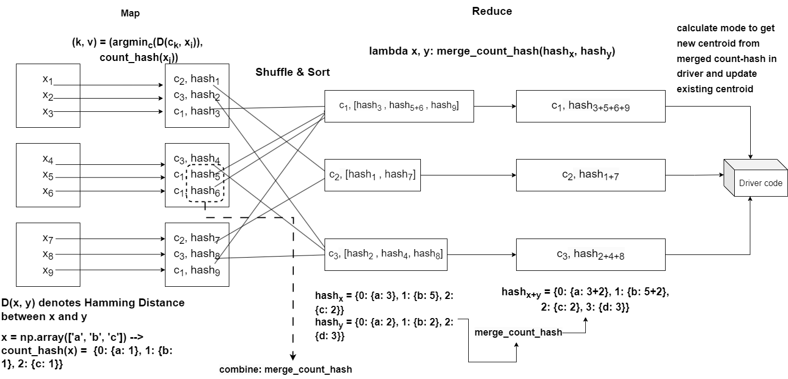

# Parallelized Clustering Algorithms with PySpark

This project implements three clustering algorithms - KMeans, KMode, KPrototype, and DBSCAN - using both local and global parallelized approach with PySpark. The algorithms are implemented separately and organized into different subdirectories within the repository.

## Clustering Algorithms Implemented

1. **KMeans**: KMeans is a popular clustering algorithm that partitions data into 'k' clusters based on similarity of features.

2. [**KMode**](https://projects.cs.nott.ac.uk/ppxpj2/big-data-project/-/tree/main/kmode?ref_type=heads): KMode is a clustering algorithm specifically designed for categorical data, where clusters are formed based on the mode of categories. Both local and global implementations are provided in this directory, along with an experimental notebook demonstrating how the size-up and num partition affect runtime. There are also notebooks that includes a step-by-step explanation of implementation.

3. **KPrototype**: KPrototype extends KMeans to handle both numerical and categorical data, allowing for more versatile clustering in mixed data types.

4. **DBSCAN**: DBSCAN (Density-Based Spatial Clustering of Applications with Noise) is a density-based clustering algorithm that groups together data points that are closely packed, while marking outliers as noise.

## KMode
### global approach

During the mapping phase, centroids $\mathbf{c^{(k)}}$ are broadcast to worker nodes, and the Hamming distance $D(\mathbf{x^{(i)}}, \mathbf{c^{(k)}})$ between centroids and data points $\mathbf{x^{(i)}}$ is computed. Each data point is hashed into a format facilitating efficient processing in the reduce phase, simplifying mode calculation. The reduce phase aggregates hashed data counts within each cluster, utilizing a reducer function to combine counts.

After computing merged count hashed data for each cluster, representing (cluster, merged count-hash) pairs, they are transmitted to the driver code. Subsequently, new centroids $\mathbf{c^{(k)}}$ are determined by computing mode values based on the aggregated counts. These updated centroids are then broadcast to worker nodes for subsequent iterations.

The iterative process continues until convergence, indicated by the Hamming distance between new and old centroids reaching the stopping criterion of 0, signifying identical centroids.

### local approach

In this approach, we adopt a parallelized strategy where the sequential model learns from each data partition concurrently. Thus, dividing the full dataset into N partitions and selecting K as the number of clusters results in the mapping phase generating NxK centroids as output, transmitted to the driver. These centroids, each representing the mode of clusters within its partition, collectively approximate the behavior of the sequential algorithm. Considering these centroids as a dataset, KMode clustering is performed in the driver code to derive the final centroids for K clusters.

### Files Description

#### experiments_notebook
The notebooks in this folder contain both the Kmode global and local approaches. We also keep versions showing failures and mistakes to demonstrate what we've learned from this project.

**Please refer to `kmode/experiments_notebook/K-Mode-global3.ipynb` and `kmode/experiments_notebook/K-Mode-local2.ipynb` if you want to try out our implementation of the global and local approaches, respectively. The required packages to run our code are provided in requirements.txt.**

- `kmode/experiments_notebook/K-Mode-local.ipynb`: The initial version of the local implementation where there was an issue with `np.apply_along_axis`, resulting in strings having only the first character, leading to incorrect centroids. This has been fixed in `./experiments_notebook/K-Mode-local2.ipynb`.

- `kmode/experiments_notebook/K-Mode-global.ipynb`: The first version of the global implementation, where we simply mapped centroids in the mapping phase and grouped all the data in the reducing phase, then sent them back to the driver to calculate the mode. This was inefficient as it involved a lot of data movement and didn't utilize the reducing process well.

- `kmode/experiments_notebook/K-Mode-global2.ipynb`: The second version of the global implementation, where we counted the number of occurrences of elements within the reducer phase to reduce data movement from the reducer phase to the driver. However, the data movement from the mapping phase to the reducing phase remained the same. We then implemented mini-reducers in the final version `./experiments_notebook/K-Mode-global3.ipynb`.

#### Module
The final implementation has been rewritten in a class object style, but we suggest testing using notebooks for better visibility.

- `kmode/kmode_global.py`: This file contains the global implementation of KMode as a Python class object.

- `kmode/kmode_local.py`: This file contains the local implementation of KMode as a Python class object. In each partition, it uses a sequential KMode object from `kmode_sequential.py` to learn on data in their partition.

### Result

#### Algorithm Approximation

The results from the global and sequential approaches are an exact match; however, the local approach provides only an approximation.

| Feature                  |  | Global & Sequential |  |  | Local |  |
|--------------------------|---------------------|---------------------|---------------------|-------|-------|-------|
| Cluster                  | 1                   | 2                   | 3                   | 1     | 2     | 3     |
| cap-shape                | f                   | x                   | f                   | x     | x     | x     |
| cap-surface              | nan                 | y                   | x                   | nan   | nan   | h     |
| cap-color                | n                   | n                   | x                   | n     | n     | n     |
| does-bruise-or-bleed     | f                   | f                   | f                   | f     | f     | f     |
| gill-attachment          | d                   | a                   | d                   | d     | a     | d     |
| gill-spacing             | c                   | nan                 | c                   | c     | nan   | c     |
| gill-color               | w                   | w                   | w                   | w     | w     | w     |
| stem-root                | nan                 | nan                 | nan                 | nan   | nan   | nan   |
| stem-surface             | nan                 | nan                 | nan                 | nan   | nan   | nan   |
| stem-color               | w                   | w                   | w                   | w     | w     | w     |
| veil-type                | nan                 | nan                 | nan                 | nan   | nan   | nan   |
| veil-color               | nan                 | nan                 | nan                 | nan   | nan   | nan   |
| has-ring                 | f                   | t                   | f                   | f     | f     | t     |
| ring-type                | f                   | f                   | f                   | f     | f     | e     |
| spore-print-color        | nan                 | nan                 | nan                 | nan   | nan   | nan   |
| habitat                  | d                   | d                   | d                   | d     | d     | d     |
| season                   | u                   | a                   | u                   | a     | a     | u     |

Table: Comparison of the final centroids obtained from clustering secondary mushroom dataset with KMode algorithm with sequential, global and local approach

| Feature | Global & Sequential Cluster 1 | Global & Sequential Cluster 2 | Global & Sequential Cluster 3 | Local Cluster 1 | Local Cluster 2 | Local Cluster 3 |
|---------|-------------------------------|-------------------------------|-------------------------------|-----------------|-----------------|-----------------|
| bin\_0  | 0.0                           | 0.0                           | 0.0                           | 0.0             | 0.0             | 0.0             |
| bin\_1  | 0.0                           | 0.0                           | 0.0                           | 0.0             | 0.0             | 0.0             |
| bin\_2  | 0.0                           | 0.0                           | 0.0                           | 0.0             | 0.0             | 0.0             |
| bin\_3  | F                             | T                             | F                             | F               | F               | T               |
| bin\_4  | N                             | N                             | N                             | N               | Y               | N               |
| nom\_0  | Red                           | Red                           | Blue                          | Red             | Red             | Blue            |
| nom\_1  | Polygon                       | Trapezoid                     | Triangle                      | Triangle        | Triangle        | Triangle        |
| nom\_2  | Hamster                       | Hamster                       | Dog                           | Axolotl         | Hamster         | Hamster         |
| nom\_3  | India                         | Finland                       | Costa Rica                    | India           | India           | India           |
| nom\_4  | Bassoon                       | Theremin                      | Theremin                      | Theremin        | Theremin        | Theremin        |
| nom\_5  | nan                           | nan                           | nan                           | nan             | nan             | nan             |
| nom\_6  | nan                           | nan                           | nan                           | nan             | nan             | nan             |
| nom\_7  | nan                           | nan                           | nan                           | nan             | nan             | nan             |
| nom\_8  | nan                           | nan                           | nan                           | nan             | nan             | nan             |
| nom\_9  | nan                           | nan                           | nan                           | nan             | nan             | nan             |
| ord\_0  | 2.0                           | 1.0                           | 1.0                           | 1.0             | 3.0             | 1.0             |
| ord\_1  | Expert                        | Novice                        | Contributor                   | Novice          | Novice          | Novice          |
| ord\_2  | Freezing                      | Freezing                      | Freezing                      | Freezing        | Freezing        | Freezing        |
| ord\_3  | n                             | n                             | a                             | n               | n               | a               |
| ord\_4  | Y                             | N                             | R                             | N               | P               | N               |
| ord\_5  | nan                           | nan                           | nan                           | nan             | nan             | nan             |
| day     | 1.0                           | 6.0                           | 7.0                           | 3.0             | 5.0             | 3.0             |
| month   | 6.0                           | 7.0                           | 5.0                           | 8.0             | 8.0             | 5.0             |

Table: Comparison of the final centroids obtained from clustering Kaggle categorical encoding competition II dataset using the KMode algorithm with sequential, global, and local approaches.

#### Size up experiment on global approach

## Getting Started

To get started with using these clustering algorithms:

1. Navigate to the respective subdirectory for the algorithm you're interested in.
2. Follow the instructions provided in the README file within each directory for installation, usage, and examples.
3. Ensure you have PySpark installed and configured to run the algorithms in a distributed environment.